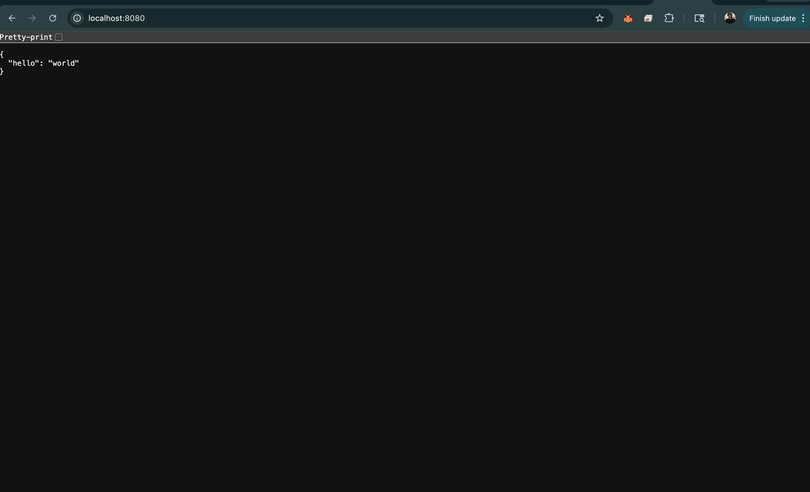

# Flask on Docker

This project is a Dockerized Flask app for CSCI 143. It uses Docker Compose to run a Flask web service with a Postgres database, and the app returns a simple JSON response when the container is running.

